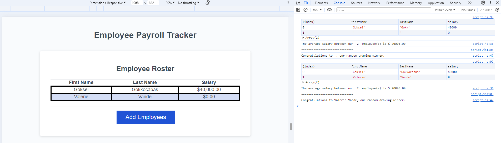

Title: 
Employee-Payroll-Tracker

Description:
In this challenge, I have edited Javascript code to properly enter employee information and their salary then list them at the end of the process. I have used While loop to collect employee data and used various different functions to implement the desired outcome.

How to Run:
Simply go on to the website and click "Add Employee" Button to start the process.
User will be prompted three windows to enter employee's first name, last name and their salary.
User then will be prompted if they would like to continue adding more employees.
Click "OK" to continue and click "cancel" to see the list of employee's information sorted by their last name.
In the Console Log of the browser, you could see an average employee salary and the winner of the contest as well as the same list of employee.
